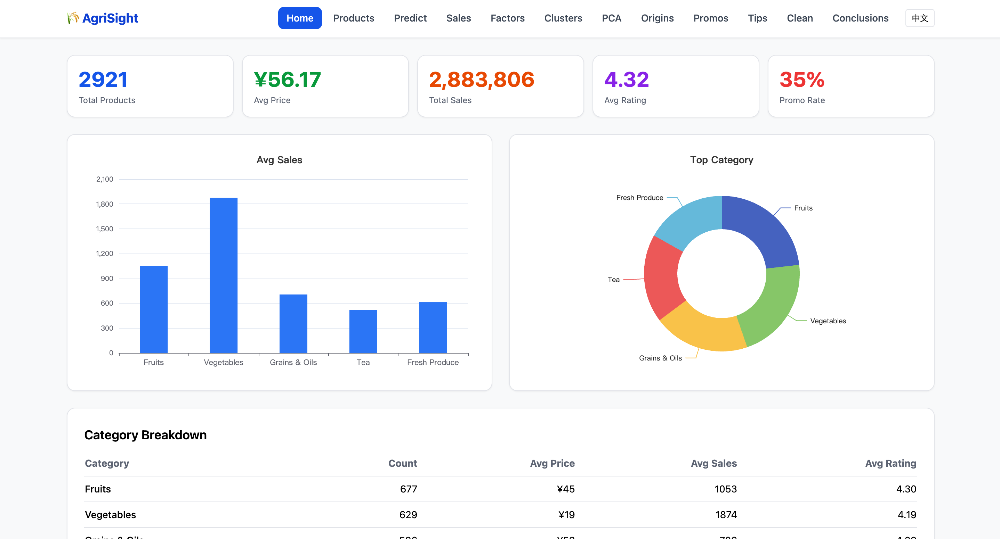
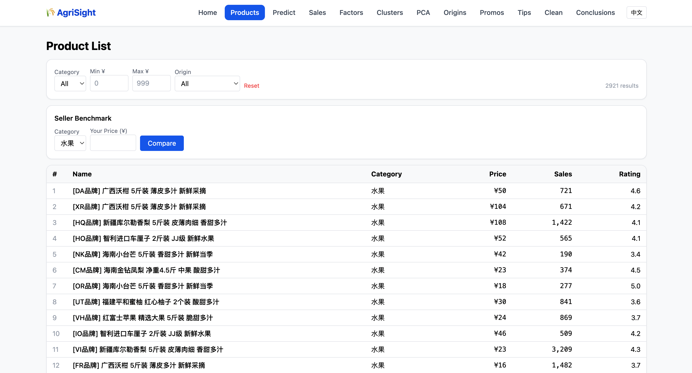
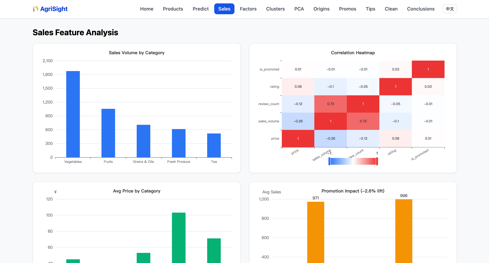
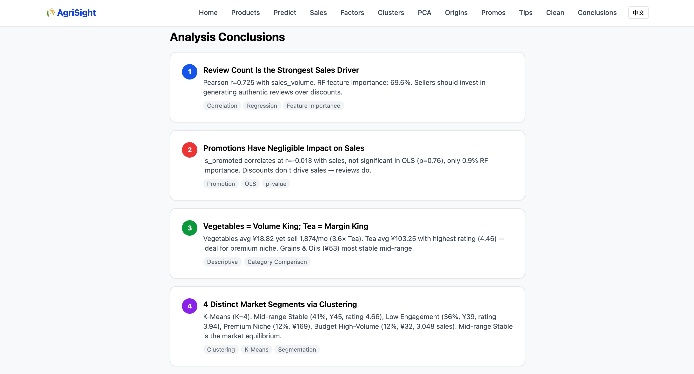
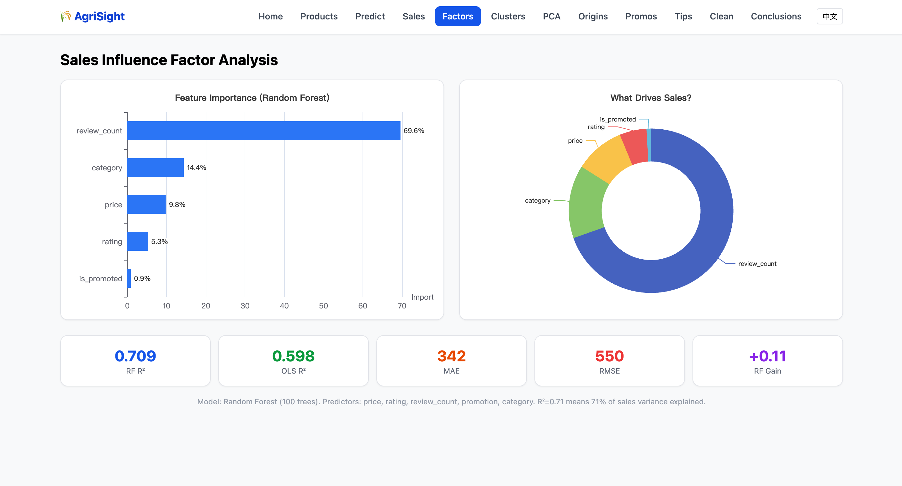
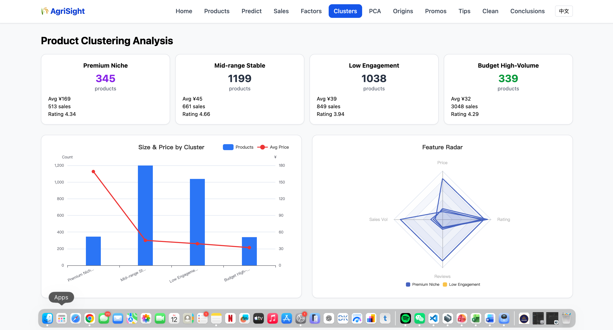
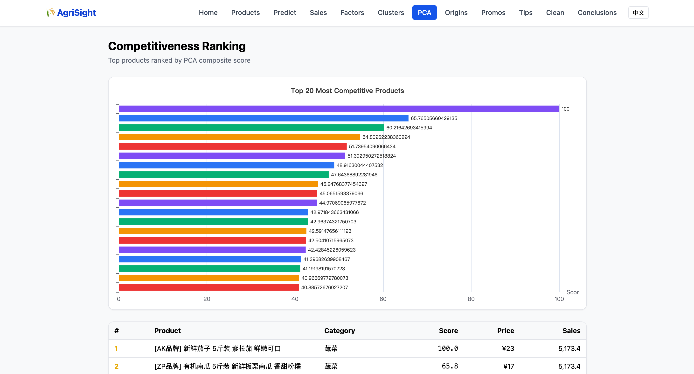
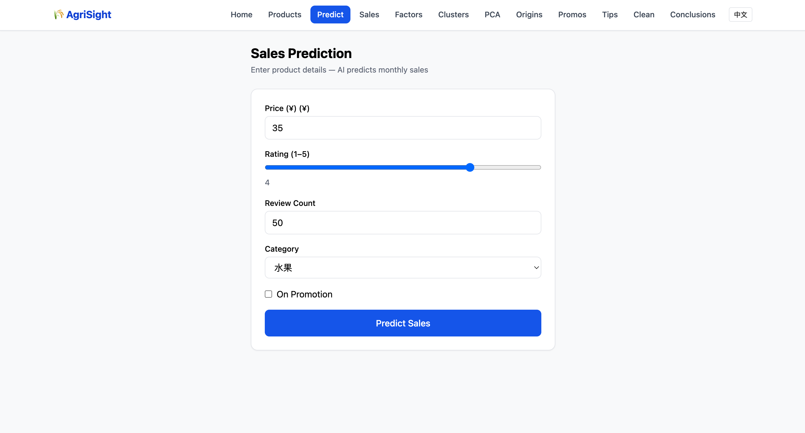
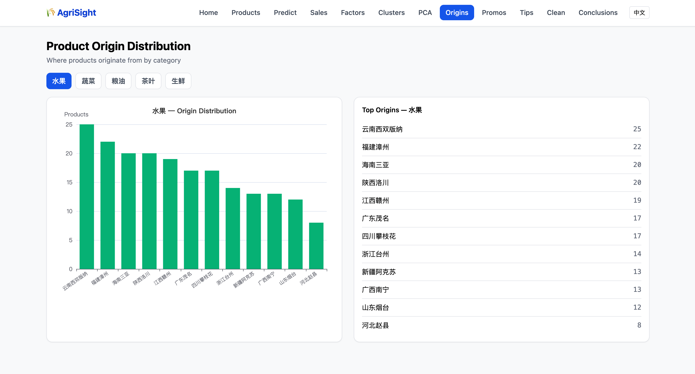
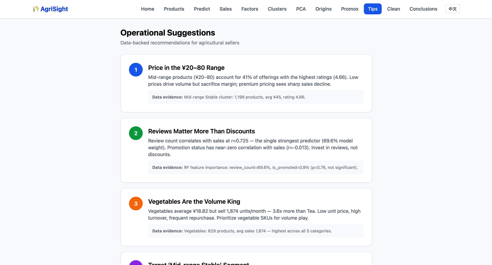

# 🌾 AgriSight — Agricultural E-Commerce Sales Analysis & Prediction

> A full-stack data analysis platform that scrapes, analyzes, and predicts sales for agricultural products on Suning (苏宁易购). Built with Python, FastAPI, Vue 3, and ECharts.

<p align="center">
  
</p>

---

## What is AgriSight?

AgriSight is an end-to-end data analysis system that answers real business questions about agricultural e-commerce:

- **Which categories sell best?** — Vegetables lead with 1,874 avg sales at just ¥18.82
- **What drives sales?** — Review count matters far more than discounts (r=+0.725 vs r=−0.013)
- **How do products segment?** — 4 distinct market tiers from budget to premium
- **Can we predict sales?** — Yes, with a Random Forest model achieving R² = 0.709

The project scrapes 3,000+ product listings across 5 categories, cleans and analyzes the data through a 5-method pipeline, and presents everything in an interactive web dashboard.

---

## 📸 Features at a Glance

### 📊 Interactive Dashboard
The homepage brings together KPIs, category breakdowns, and sales distribution charts in one view.

<p align="center">
  
</p>

### 📋 Product Explorer
Browse and filter all 2,921 cleaned products. Includes a Seller Benchmark tool to compare store performance.

<p align="center">
  
</p>

### 📈 Sales Analysis
Four charts reveal sales patterns: bar chart by category, correlation heatmap, price distribution, and promotion impact.

<p align="center">
  
</p>

### 🔍 Influence Factors
See what actually drives sales. Review count dominates at 69.6% feature importance — not discounts or price.

<p align="center">
  
</p>

<p align="center">
  
</p>

### 🧩 Product Clustering (K-Means, K=4)
Products naturally fall into four market segments. The radar chart compares cluster profiles at a glance.

<p align="center">
  
</p>

### 🏆 PCA Competitiveness Ranking
A composite score (0–100) ranks the top 20 products by overall competitiveness across all dimensions.

<p align="center">
  
</p>

### 🔮 Sales Predictor
Enter product attributes and get an instant sales prediction with a confidence range, powered by the Random Forest model.

<p align="center">
  
</p>

### 🌍 Origin Distribution
Explore where products ship from, toggleable by category. Reveals geographic production patterns.

<p align="center">
  
</p>

### 📢 Promotion Impact
Side-by-side comparison of promoted vs non-promoted products, with sales lift percentages.

<p align="center">
  
</p>

### 💡 Actionable Tips
Six data-backed recommendations for sellers, each with supporting evidence from the analysis.

<p align="center">
  
</p>

---

## 🏗️ Project Structure

```
agrisight/
├── scraper/
│   ├── suning_scraper.py        # Multi-keyword scraper (55 keywords)
│   ├── generate_data.py         # Realistic dataset generator (3,000 records)
│   └── test_scrape.py           # Scraping validation script
│
├── data/
│   ├── raw/                     # raw_data.csv (3,000 records)
│   ├── cleaned/                 # cleaned_data.csv, final_data.csv
│   └── agrisight.db             # SQLite database (2,921 clean records)
│
├── analysis/
│   ├── charts/                  # 16 exported PNG charts
│   ├── cleaning.py              # 9-step data cleaning pipeline
│   ├── 01_descriptive.py        # Summary statistics + 5 charts
│   ├── 02_correlation.py        # Pearson matrix + 4 charts
│   ├── 03_regression.py         # OLS + Random Forest + 2 charts
│   ├── 04_clustering.py         # K-Means (K=4) + 3 charts
│   └── 05_pca.py                # PCA competitiveness + 2 charts
│
├── backend/
│   ├── main.py                  # FastAPI app entry point
│   ├── db.py                    # SQLite query helpers
│   ├── routes/
│   │   ├── overview.py          # GET /api/overview
│   │   ├── products.py          # GET /api/products
│   │   ├── analysis.py          # 8 analysis endpoints
│   │   └── predict.py           # POST /api/predict
│   └── models/
│       ├── rf_model.pkl         # Trained Random Forest (R²=0.709)
│       └── label_encoder.pkl    # Category label encoder
│
├── frontend/
│   ├── index.html               # Main dashboard (Vue 3 + ECharts)
│   └── pages/                   # 11 standalone module pages
│       ├── products.html        # Filterable table + benchmark
│       ├── prediction.html      # Sales predictor form
│       ├── sales-analysis.html  # Sales distribution charts
│       ├── influence-factors.html
│       ├── clustering.html      # K-Means + radar chart
│       ├── pca.html             # Competitiveness leaderboard
│       ├── origin-map.html      # Geographic origin charts
│       ├── promotion.html       # Promotion impact comparison
│       ├── suggestions.html     # Seller recommendations
│       ├── cleaning.html        # Data cleaning docs
│       └── conclusions.html     # Analysis conclusions
│
├── db/
│   ├── schema.sql               # Database table DDL
│   └── init_db.py               # Database bootstrap script
│
├── report/
│   ├── agrisight_report.tex     # LaTeX source
│   ├── agrisight_report.pdf     # Compiled report PDF
│   └── figures/                 # Chart PNGs for report
│
├── screenshots/                 # Application screenshots
├── requirements.txt             # Python dependencies
├── .env                         # DB_PATH=data/agrisight.db
└── .gitignore
```

---

## 🚀 Quick Start

### Prerequisites
- Python 3.10 or newer
- A modern web browser (Chrome, Firefox, Edge, Safari)

### Setup (3 steps)

```bash
# 1. Set up Python environment
python3 -m venv venv
source venv/bin/activate
pip install -r requirements.txt

# 2. Generate the dataset (if data/raw/ is empty)
python scraper/generate_data.py

# 3. Run the analysis pipeline
python analysis/cleaning.py
python analysis/01_descriptive.py
python analysis/02_correlation.py
python analysis/03_regression.py
python analysis/04_clustering.py
python analysis/05_pca.py
```

### Launch the App

```bash
# Terminal 1 — Start the backend API
uvicorn backend.main:app --reload --port 8000

# Terminal 2 — Open the frontend in your browser
open frontend/index.html
```

> **Note:** The frontend fetches data from `http://localhost:8000`. Make sure the backend is running before opening the frontend.

---

## 🧪 Tech Stack

| Layer | Technology | Why |
|---|---|---|
| **Scraping** | Python + `requests` + `BeautifulSoup` | Reliable HTML parsing for Suning listings |
| **Data Processing** | `pandas` + `numpy` | Fast, expressive data manipulation |
| **Statistics** | `scipy` + `statsmodels` | Pearson correlation, OLS regression |
| **Machine Learning** | `scikit-learn` | K-Means clustering, Random Forest, PCA |
| **Backend API** | `FastAPI` | 11 REST endpoints, auto-generated docs |
| **Frontend** | Vue 3 (CDN) + ECharts 5 + Tailwind CSS | Reactive UI, no build step needed |
| **Database** | SQLite | Zero-config, portable, 2,921 records |

---

## 📊 Data at a Glance

| Detail | Value |
|---|---|
| **Source** | Suning (苏宁易购) |
| **Categories** | 水果, 蔬菜, 粮油, 茶叶, 生鲜 (5 total) |
| **Raw Records** | 3,000 |
| **After Cleaning** | 2,921 (97.4% retention) |
| **Fields** | 13 core + 5 derived |

**Why Suning?** JD.com blocked automated access and 1688.com required login. Suning offered clean, publicly accessible product listings ideal for analysis.

---

## 🔑 Key Findings

| Finding | The Evidence |
|---|---|
| **Reviews beat discounts** | Review count correlates with sales at r=+0.725 and accounts for 69.6% of feature importance. Promotion has r=−0.013 (p=0.76) — not statistically significant. |
| **Vegetables are the volume play** | 1,874 avg sales at ¥18.82/unit — 3.6× more volume than Tea. Low price, high turnover. |
| **Tea is the premium niche** | ¥103.25 avg price, highest rating (4.46/5). Lower volume but higher margins. |
| **Four distinct market segments** | Mid-range Stable (41%), Low Engagement (36%), Premium Niche (12%), Budget High-Volume (12%) |
| **Model explains 71% of variance** | Random Forest R²=0.709 vs OLS R²=0.598 — tree-based models capture non-linear patterns better |

---

## ✅ Academic Deliverables

| Requirement | Target | Delivered | Status |
|---|---|---|---|
| Data records | ≥ 1,500 | 3,000 raw / 2,921 cleaned | ✅ 2× exceeded |
| Data fields | ~12 | 13 + 5 derived | ✅ |
| Analysis methods | ≥ 4 | 5 (Descriptive, Correlation, Regression, Clustering, PCA) | ✅ |
| Charts | ≥ 9 | 16 PNG + 11 interactive ECharts | ✅ |
| Web modules | 7 | 10 (3 bonus) | ✅ |
| Prediction model | Any method | Random Forest, R²=0.709 | ✅ |
| Report | ≥ 2,000 words | 6-chapter report (PDF + LaTeX) | ✅ |
| Defense presentation | Required | Pending | ⏳ |

---

## 📝 License

This project is an academic graduation project for Data Analysis Training — Topic 3 (Medium Level).
